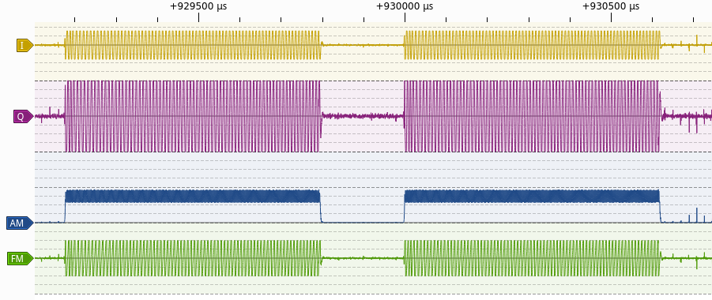

# RTLSDR-to-Pulseview
An application which takes samples from an RTL-SDR and creates a .sr file with various demodulations for use in Sigrok and Pulseview.

Requires libzip and librtlsdr:

```bash
sudo apt install libzip-dev
sudo apt install librtlsdr-dev
```

Make:

```bash
make
```

Usage:

```bash
./rtl_sampler frequency [sample rate]`
pulseview file.sr
```


